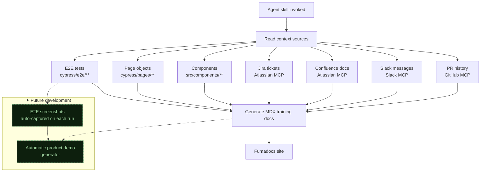
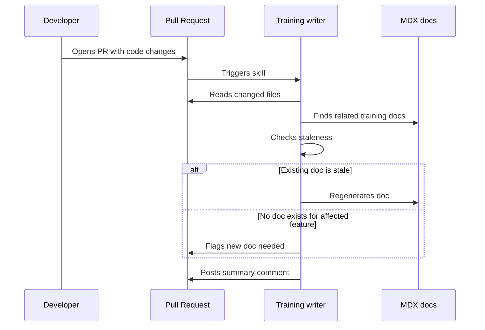
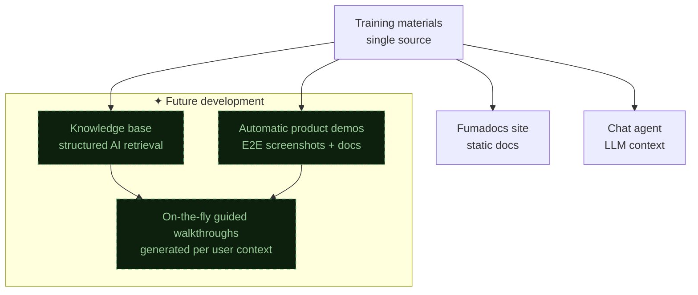

The sample tracking platform at work has the documentation problem every internal tool eventually gets — the people who built it know how it works, the people who use it learn by asking those people, and nothing written down stays current for more than a sprint. I decided to fix that by making an agent write the docs instead of a human.

## The system

The output is a Next.js docs site built with [Fumadocs](https://fumadocs.vercel.app/), added as a new `docs/` module in the sample tracking monorepo. Fumadocs handles the docs framework — search, navigation, MDX support — while the content comes from an agent skill that reads the codebase and surrounding context to generate training materials.

The skill itself is a Cursor agent skill (a markdown instruction file that shapes how the agent operates in the IDE). When invoked, it reads multiple context sources and produces structured training documents: step-by-step workflows, feature explanations, troubleshooting guides. The documents land as MDX files in the Fumadocs content directory, ready to build and deploy with the rest of the monorepo.

## Multi-source context reading

The core insight was that no single source tells you how a feature actually works in practice. The codebase tells you what's possible; Jira tells you what was intended; Slack tells you what confused people; E2E tests tell you what the expected workflows look like. So the agent reads all of them:



E2E tests turned out to be the most valuable source. A Cypress test that walks through creating a sample, assigning it to a tracking group, and validating the status update is essentially a user workflow written in code. The agent restructures that into prose with screenshots placeholders and callouts for the parts users typically get wrong — which it learns from Slack messages asking about those exact steps.

## PR-triggered updates

The static generation was step one. The real goal was keeping docs current without anyone thinking about it. The skill runs on every PR: it reviews the code changes, identifies which features are affected, cross-references existing training materials, and either updates them or flags that a new document is needed.

```typescript
// Simplified PR-triggered flow
async function onPROpen(pr: PullRequest) {
  const changedFiles = await getChangedFiles(pr);
  const affectedFeatures = mapFilesToFeatures(changedFiles);
  const existingDocs = await findRelatedDocs(affectedFeatures);

  for (const doc of existingDocs) {
    const isStale = await checkStaleness(doc, changedFiles);
    if (isStale) {
      await regenerateDoc(doc, {
        prContext: pr,
        codeChanges: changedFiles,
        existingContent: doc.content,
      });
    }
  }

  const uncoveredFeatures = affectedFeatures.filter(
    (f) => !existingDocs.some((d) => d.coversFeature(f))
  );
  if (uncoveredFeatures.length > 0) {
    await flagNewDocsNeeded(uncoveredFeatures, pr);
  }
}
```

This means documentation drift — the thing that kills every internal docs site — gets caught at the PR level. A developer changes how sample assignment works, and the training material for "How to assign samples" gets flagged for regeneration in the same PR review cycle.



## What actually worked

**E2E tests as documentation source material.** Page objects give you the UI vocabulary (what buttons exist, what forms are present), and the test flows give you the user journey. Converting `cy.get('[data-testid="assign-btn"]').click()` into "Click the Assign button in the sample detail panel" is mechanical — exactly the kind of transformation agents handle well.

**Slack as a confusion signal.** Messages like "where do I find the batch import?" or "the status didn't update after I submitted" are direct inputs to what the docs should cover and what the common failure modes are. The agent uses these to add troubleshooting sections and to prioritize which workflows get documented first.

**Separating generation from curation.** The agent generates a first draft from multi-source context, but the output goes through human review before publishing. The skill produces clean MDX with TODO markers where screenshots or domain-specific callouts should go. The training materials are agent-written but human-approved.

## The bigger picture

The Fumadocs site is the first consumer, but the training materials are structured for a second use case: feeding a company chat agent. The documents are written in a way that's both human-readable and parseable as context for an LLM — clear headings, explicit workflow steps, defined terminology. When the chat agent eventually ships, the same content that trains humans will train the AI assistant.

> The best documentation system is one where no human has to remember to update docs. The agent reads the PR, reads the existing docs, and either updates them or asks for help. Documentation becomes a side effect of shipping code.

There's also a guided walkthrough layer on the roadmap — interactive tutorials embedded in the platform itself, generated from the same underlying content. The training materials become the single source that powers static docs, chat agent context, and in-app guidance. Three surfaces, one authoring pipeline, zero manual maintenance.



## What I'd do differently

I'd start with the E2E tests and skip the Slack/Confluence reading for the initial version. The multi-source approach is powerful but adds complexity in context management — how much of a Slack thread is relevant? How stale is this Confluence page? E2E tests are always current (they break if they're not) and always structured. Get the test-to-docs pipeline solid first, then layer in the softer context sources.
